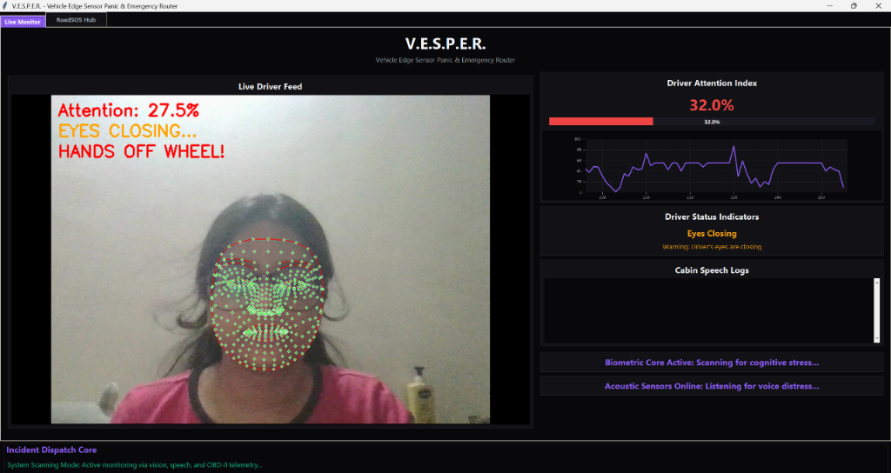
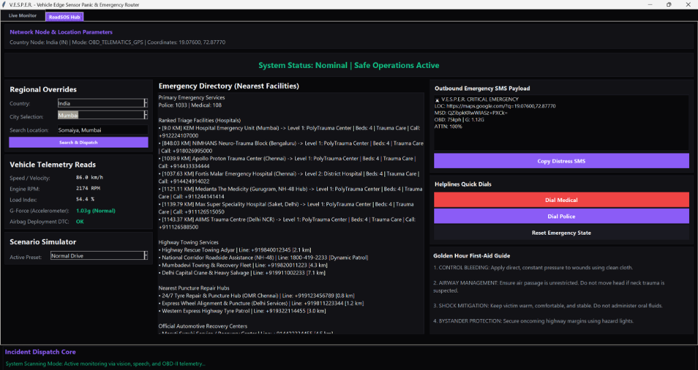

# 🚗 V.E.S.P.E.R. - Vehicle Edge Sensor Panic & Emergency Router

**V.E.S.P.E.R.** is a resilient, edge-native vehicle safety terminal designed to transform automotive safety from a reactive monitoring dashboard into an autonomous, multi-modal crisis response ecosystem. 

Built to target the critical post-crash **"Golden Hour"** window highlighted by the **IIT Madras Centre of Excellence for Road Safety (CoERS)**, the system integrates computer vision, in-cabin acoustic natural language processing (NLP), and vehicle telematics via On-Board Diagnostics (OBD-II) into a single, unified platform.

---

## 📸 System Dashboards in Action

### Tab 1: Live Safety Monitor (Biometrics Feed)


### Tab 2: RoadSOS Hub (India-Wide Real-Time Emergency Triage Routing)


---

## 📖 Project Overview & Core Logic

Unlike standard navigation apps that fail during network outages or route traffic uniformly regardless of medical requirements, **V.E.S.P.E.R.** features a deterministic **Clinical-Aware Triage Routing Engine**. When an incident occurs (such as a high-G deceleration signature or an occupant's verbal cry for help), the application overrides standard operations and redirects resources to a 100% offline geodetic spatial dashboard. This engine runs geodetic Haversine calculations locally on the CPU to index, filter, and rank nearby rescue infrastructure based on their clinical capabilities and spatial proximity.

### Multi-Modal Edge Sensing Matrix:
1.  **Vision Edge (FaceMesh + YOLOv8)**: Processes live video frames, tracking 468 facial landmark vectors. It calculates Eye Aspect Ratio (EAR) and Mouth Aspect Ratio (MAR) to alert on blinks or yawning, and utilizes a lightweight YOLOv8 object detector to identify phone use and distractions.
2.  **Audio Edge (Acoustic NLP & RMS)**: Listens for vocal help distress words (e.g., "help", "police", "accident") using background speech recognition, tracks scream signatures via raw audio amplitude (RMS) spikes, and audits driver speech anomalies.
3.  **Telematics Edge (OBD-II CAN Bus)**: Queries vehicle parameters (RPM, velocity, accelerometer G-forces, and Airbag deployment codes) to confirm vehicle kinematic states.

---

## 🖥️ User Interface Layout & Explanations

The dashboard features a high-contrast obsidian dark theme designed for night-driving legibility and immediate responsiveness. It implements a two-tab navigation structure:

### Tab 1: Live Monitor
Renders the visual, audio, and kinematic safety metrics during standard driving conditions:
*   **Live Driver Feed**: Display screen showing camera frames overlaid with green FaceMesh facial contour indicators and blue hands tracking lines. Displays bounding boxes around detected mobile phones (yellow when idle, red when held).
*   **Driver Attention Index**: A large, color-coded percentage display (Green: Attentive, Amber: Warning, Red: Critical) showing the driver's real-time safety score. Accompanied by a rolling line chart plotting attention history.
*   **Driver Status Indicators**: Displays text status updates (e.g., "Attentive", "Drowsiness Detected", "Eyes Closing", "Hands Off Wheel", or "Driver on Call").
*   **Cabin Speech Logs**: A scrolling transcript window showing in-cabin audio text as it is spoken.
*   **Incident Warning Panels**: Flashing alert banners at the bottom right that illuminate red during severe biometric stress or voice distress warnings.
*   **Simulate Collision Button**: An explicit trigger button at the bottom of the tab allowing hardware-free testing of the entire eCall crash pipeline.

### Tab 2: RoadSOS Hub
An emergency dispatch triage hub that activates automatically during alerts or vehicle crashes:
*   **Network & Location Parameters**: Top banner indicating current GPS coordinates, network status (Online/Offline), and active country nodes.
*   **Regional Overrides & Real-Time Search**: 
    *   **Country Selection**: Locked strictly to **India** for national-level operations.
    *   **City Selection Dropdown**: Direct override routes for major Indian cities: `Chennai`, `Bengaluru`, `Mumbai`, `Delhi`, `Kolkata`, `Hyderabad`, and `Pune`.
    *   **Search Location Entry & Button**: A search box allowing the user to type in **any place, college, or landmark in India** (e.g. *IIT Madras*, *Sion Mumbai*, or *Somaiya College*). Clicking `"Search & Dispatch"` geocodes the query dynamically using the OSM Nominatim API, centers the router at those exact coordinates, and pulls live infrastructure datasets.
*   **Vehicle Telemetry Reads**: Displays live speed readouts, RPM, G-force accelerations, and airbag diagnostic trouble codes.
*   **Scenario Simulator Preset Dropdown**: Simulates driving conditions (e.g., swerving, hard braking, or critical side impact) to test the dashboard.
*   **Emergency Directory**: Lists actual nearby local rescue facilities (Hospitals, Police Patrols, Towing Services, Puncture Hubs) retrieved in real time. Proximity calculations and trauma level penalties prioritize major trauma centers during collisions.
*   **Outbound Emergency SMS Payload**: Shows the exact compressed distress message containing location shortlinks and bitpacked OBD telemetry.
*   **Helpline Quick Dials**: Allows one-touch dialing connection simulation to Medical or Police dispatch.
*   **Golden Hour First-Aid Guide**: A responsive, full-width quick reference guide listing critical emergency care protocols. The text wraps dynamically based on window resize actions to optimize screen usage.

---

## 🛠️ Repository Architecture

```
vesper/
├── data/
│   ├── trauma_centers.json       <-- Ground-Truth offline hospital registry (IN/US Datasets)
│   └── safety_audit_log.txt      <-- Secure, continuous ledger logging safety anomalies
├── src/
│   ├── main.py                   <-- Central Coordinator Thread & Sensor Aggregator
│   ├── video.py                  <-- Video Capture Stream Handler
│   ├── detection.py              <-- FaceMesh (EAR/MAR) & YOLOv8 Object Tracking
│   ├── audio.py                  <-- Asynchronous Acoustic NLP Thread & Keyword Intercept
│   ├── obd_telemetry.py          <-- Kinematic Vehicle Data & Structural Crash Signatures
│   ├── sos_router.py             <-- Offline Haversine Math & Triage Matrix Sorting
│   ├── location_service.py       <-- Resilient Network Check & On-Device GPS Cache Manager
│   ├── emergency_db.py           <-- Pre-Cached Infrastructure Matrix (IN/US Datasets)
│   └── gui.py                    <-- Obsidian GUI overlays & responsive layout bindings
├── requirements.txt              <-- Telematics, Computer Vision, & Serial dependencies
└── README.md                     <-- Detailed system documentation
```

---

## ⚙️ Key Technical Enhancements

1.  **National Indian Scale Geocoding**: Integrated OpenStreetMap's **Nominatim Geocoding API** to resolve coordinates dynamically for any user input inside India.
2.  **Real-Time Police and Hospital Integration**: Employs OpenStreetMap's **Overpass API** to fetch nodes and ways tagged as `amenity=hospital` or `amenity=police` within 15 km of the coordinates. Runs Haversine geodetic distance calculations on the live registers, with an offline pre-cached fallback database.
3.  **Dynamic Guide Wrapping (Full Width)**: Replaced static text wrapping with a `<Configure>` callback on `lbl_guide`. Resizing the window recalculates the guide label's wrapping length dynamically to fit the current grid column width, utilizing the full width of the card.
4.  **Corrected Aspect Ratio Distortion**: FaceMesh coordinates are scaled uniformly `(lm.x * w, lm.y * w)` instead of distorting by width and height. This ensures that Eye Aspect Ratio (EAR) and Mouth Aspect Ratio (MAR) metrics map directly to true geometric pixel coordinates, eliminating false closures or yawn detection misses.
5.  **Yawning Classification Tuning**: Lowered the yawning threshold to `0.50` and disabled the speech classification filter when the mouth is wide open (`MAR > 0.60`), ensuring yawns are captured instantly.
6.  **Active Call Speech Audits**: Links phone alerts (`LOW_ATTENTION`) directly to speech transcription. Speaking aggressive, road-rage terms (e.g., *idiot*, *fool*) during a phone call logs an `OFFENSIVE_LANGUAGE_ON_CALL_ANOMALY` to the safety audit log, and flashes an alert: `"Offensive Language While on Call Detected"`.
7.  **GUI Warning Debouncing**: Warning updates are debounced to ensure Tkinter warning dialogs trigger exactly once per transition, avoiding lag and UI hangs.

---

## 🚀 Installation & Setup

### 1. Create a Virtual Environment
```bash
python -m venv vesper
source vesper/Scripts/activate # On Windows: vesper\Scripts\activate
```

### 2. Install Dependencies
```bash
pip install -r requirements.txt
```

### 3. Run the Application
```bash
python src/main.py
```

### 4. Manual Bypass Controls
*   **ESC Key**: Press within the camera window to safely terminate processing and output the ride performance summary.
*   **Scenario simulator**: Use dropdown options (e.g., *Critical Side Impact*) to test the automatic emergency tab switch, AT command console, and triage calculations.

---

## 👤 Author

**Yashasvi Gupta**  
*CoERS Stage 1 Shortlist Submission | IIT Madras Road Safety Hackathon*
